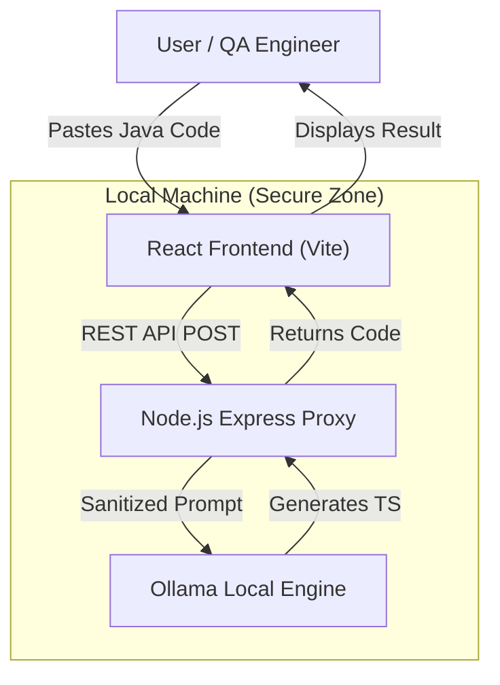

# 🚀 Selenium to Playwright Converter (Local LLM)

A **Privacy-First, AI-Powered Conversion Tool** that automatically translates legacy Selenium Java code into idiomatic Playwright TypeScript. 

Powered by **Ollama (CodeLlama)** running locally on your machine—ensuring your proprietary code never leaves your network.

---

## 🏗️ Architecture

The system follows a 3-Layer Architecture designed for security and ease of use.



---

## ✨ Features

- **100% Local Execution**: Uses Ollama + CodeLlama. No API keys, no cloud costs, no data leaks.
- **Modern UI**: Built with React, Vite, and TailwindCSS (Glassmorphism design).
- **Smart Conversion**:
  - Translates `driver.findElement` → `page.locator`.
  - Converts TestNG Annotations → Playwright Hooks.
  - Handles Waits automatically.
- **Monaco Editor**: Professional code editing experience with syntax highlighting.

---

## 🛠️ Prerequisites

1.  **Node.js** (v18+) installed.
2.  **Ollama** installed and running.
    - [Download Ollama](https://ollama.com/)
    - Pull the model:
      ```bash
      ollama pull codellama
      ```

---

## 🚀 Quick Start

### 1. Clone the Repository
```bash
git clone https://github.com/PramodDutta/Selenium2PlaywrightConverterLocalLLM.git
cd Selenium2PlaywrightConverterLocalLLM
```

### 2. Install Dependencies
```bash
# Install Root (Backend) Dependencies
npm install

# Install UI (Frontend) Dependencies
cd ui
npm install
cd ..
```

### 3. Run the Application
We have a single command to start both the Backend Proxy and the Frontend UI.

```bash
npm run dev
```

- **Frontend**: http://localhost:5173
- **Backend**: http://localhost:3001

---

## 🧩 Project Structure

```text
├── server.js              # Node.js Express Proxy (Bridges UI <-> Ollama)
├── ui/                    # React Frontend
│   ├── src/
│   │   ├── App.tsx        # Main UI Implementation
│   │   └── index.css      # Tailwind & Custom Styles
│   └── tailwind.config.js # Styling Config
└── tools/
    └── test_ollama.js     # Script to verify Ollama connection
```

---

## 🤝 Contributing

1.  Fork the repository.
2.  Create a feature branch (`git checkout -b feature/amazing-feature`).
3.  Commit your changes.
4.  Open a Pull Request.

---

**Built with ❤️ for the QA Community.**
